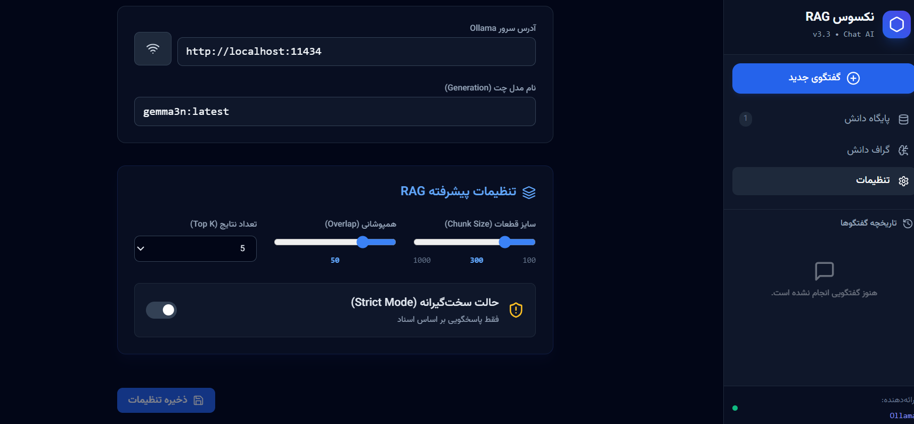
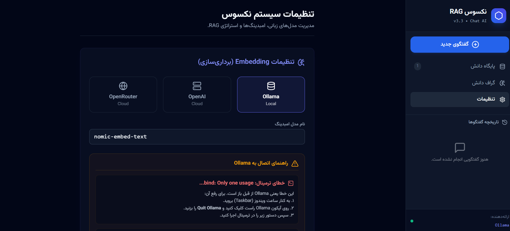
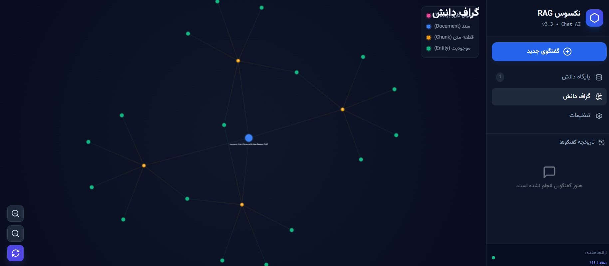
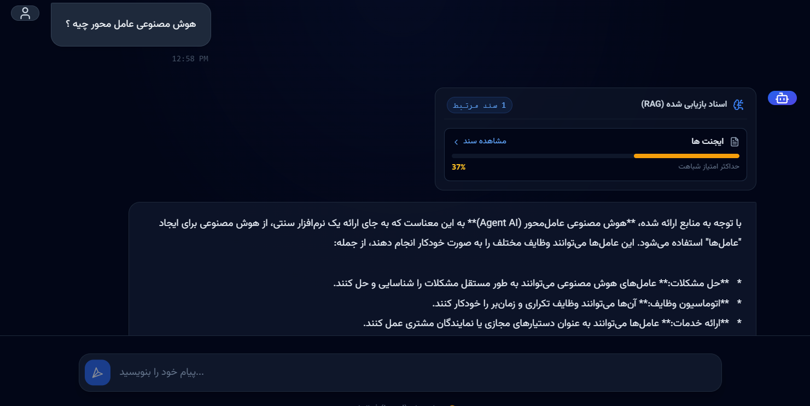

# 🧠 سیستم نکسوس (Nexus RAG System)

**نکسوس** یک پلتفرم پیشرفته **RAG (Retrieval-Augmented Generation)** است که به صورت کاملاً **Client-Side** (سمت کاربر) اجرا می‌شود. این سیستم به شما اجازه می‌دهد تا اسناد سازمانی، مقالات و فایل‌های شخصی خود را به یک "پایگاه دانش" تبدیل کرده و با استفاده از هوش مصنوعی (مانند Llama 3 یا GPT-4) با آن‌ها گفتگو کنید.

---

## 📸 نمایی از سیستم

<div align="center">
  

</div>

### 🌟 ویژگی‌های کلیدی

| قابلیت | توضیحات |
| :--- | :--- |
| **🔒 حریم خصوصی کامل** | تمام پردازش‌ها و ذخیره‌سازی داده‌ها روی مرورگر شما انجام می‌شود. هیچ سندی به سرور آپلود نمی‌شود (در حالت Local). |
| **📂 پشتیبانی از فایل‌ها** | پردازش خودکار فایل‌های **PDF**، **Word (DOCX)**، **Markdown** و **Text**. |
| **🕸️ گراف دانش تعاملی** | مصورسازی ارتباطات بین اسناد و قطعات متنی (Chunks) به صورت گراف گرافیکی. |
| **📍 نقشه راه استنتاج** | قابلیت منحصر‌به‌فرد **Inference Map** که مسیر منطقی رسیدن از "سوال" به "پاسخ" را نمایش می‌دهد. |
| **💾 حافظه پایدار** | استفاده از **IndexedDB** برای ذخیره گیگابایت‌ها اطلاعات وکتور و متن بدون از دست رفتن با رفرش صفحه. |
| **🇮🇷 رابط کاربری فارسی** | طراحی مدرن، راست‌چین (RTL) و استفاده از فونت وزیرمتن. |

---

## 🖼 گالری تصاویر

<div align="center" style="display: flex; gap: 10px; flex-wrap: wrap; justify-content: center;">
  <div>
    
  </div>
  <div>
    
  </div>
  <div>
    
  </div>
</div>

---

## 🏗 معماری فنی (Technical Architecture)

این پروژه برخلاف سیستم‌های RAG سنتی که نیاز به دیتابیس‌های وکتوری سنگین (مثل Pinecone یا Milvus) در سمت سرور دارند، تمام فرآیند را در مرورگر انجام می‌دهد:

1.  **Ingestion (ورودی):** فایل‌ها توسط کتابخانه‌های `pdfjs-dist` (برای PDF) و `mammoth` (برای Word) در مرورگر تجزیه می‌شوند.
2.  **Chunking (قطعه‌بندی):** متن‌ها به قطعات کوچکتر (Chunks) با همپوشانی (Overlap) مشخص تقسیم می‌شوند.
3.  **Embedding (برداری‌سازی):**
    *   در حالت **Local**: درخواست به `Ollama` (مدل `nomic-embed-text`) ارسال می‌شود.
    *   در حالت **Cloud**: درخواست به `OpenAI` یا `OpenRouter` ارسال می‌شود.
4.  **Vector Store (ذخیره‌سازی وکتور):** وکتورها و متادیتای آن‌ها در **IndexedDB** (دیتابیس داخلی مرورگر) ذخیره می‌شوند. این کار باعث می‌شود با بستن مرورگر، داده‌ها پاک نشوند.
5.  **Retrieval (بازیابی):** هنگام پرسش کاربر، شباهت کسینوسی (Cosine Similarity) بین وکتور سوال و وکتورهای ذخیره شده محاسبه شده و مرتبط‌ترین قطعات بازیابی می‌شوند.
6.  **Generation (تولید پاسخ):** متن‌های بازیابی شده به عنوان Context به مدل زبانی (LLM) تزریق شده و پاسخ نهایی تولید می‌شود.

### 🛠 استک تکنولوژی

*   **Frontend Framework:** React 19
*   **Language:** TypeScript
*   **Styling:** Tailwind CSS
*   **Database:** IDB (IndexedDB Wrapper)
*   **File Processing:** PDF.js, Mammoth.js
*   **Local AI:** Ollama Integration
*   **Icons:** Lucide React

---

## 🚀 راهنمای نصب و راه‌اندازی

### ۱. پیش‌نیازها
*   نصب **Node.js** (نسخه ۱۸ به بالا)
*   نصب **Ollama** از [ollama.com](https://ollama.com)

### ۲. تنظیم Ollama (بسیار مهم ⚠️)
برای اینکه مرورگر بتواند به Ollama متصل شود، باید `CORS` را فعال کنید.

1.  اگر Ollama باز است، آن را کامل ببندید (از Taskbar راست کلیک کنید و **Quit** بزنید).
2.  ترمینال را باز کنید و دستور زیر را اجرا کنید:

    **در ویندوز (PowerShell):**
    ```powershell
    $env:OLLAMA_ORIGINS="*"; ollama serve
    ```
    
    **در مک/لینوکس:**
    ```bash
    OLLAMA_ORIGINS="*" ollama serve
    ```

3.  در یک ترمینال دیگر، مدل‌های مورد نیاز را دانلود کنید:
    ```bash
    ollama pull llama3
    ollama pull nomic-embed-text
    ```

### ۳. اجرای برنامه
```bash
# نصب وابستگی‌ها
npm install

# اجرای برنامه
npm start
```
سپس مرورگر را باز کرده و به آدرس `http://localhost:3000` بروید.

---

## ❓ سوالات متداول

**۱. آیا اطلاعات من به اینترنت ارسال می‌شود؟**
خیر. اگر از حالت `Ollama` استفاده کنید، تمام پردازش‌ها روی کامپیوتر شما انجام می‌شود. تنها در صورتی که Provider را روی OpenAI یا OpenRouter قرار دهید، اطلاعات برای پردازش به API آن‌ها ارسال می‌شود.

**۲. چرا فایل PDF من خوانده نمی‌شود؟**
مطمئن شوید فایل PDF رمزگذاری شده (Password Protected) نباشد و حاوی متن قابل انتخاب باشد (عکس اسکن شده نباشد).

**۳. خطای "Network Error" یا "Failed to fetch" دریافت می‌کنم.**
این خطا معمولاً یعنی Ollama اجرا نشده یا تنظیمات CORS (مرحله ۲ نصب) انجام نشده است. مطمئن شوید دستور `ollama serve` در حال اجراست.
